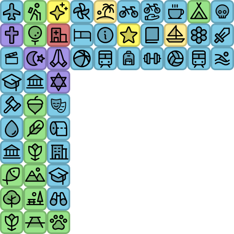
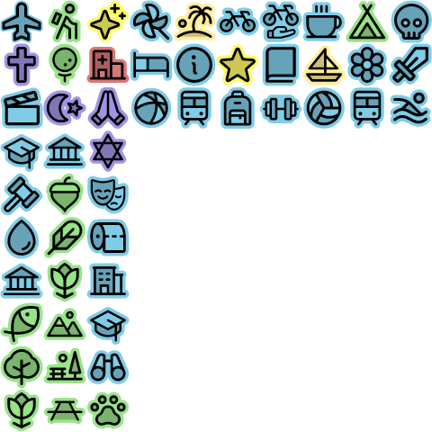

## Phosphor icons as Maplibre GL sprite
[Phosphor icons](https://phosphoricons.com/) are great! This project uses a small selection of them with a background color to show on a map as 24x24px icons:

- **Square shaped:**
  

- **die cut:**
  

## Generate
To generate the sprite, we use [spreet](https://github.com/flother/spreet). Once installed, just do:

```bash
./generate.sh
```