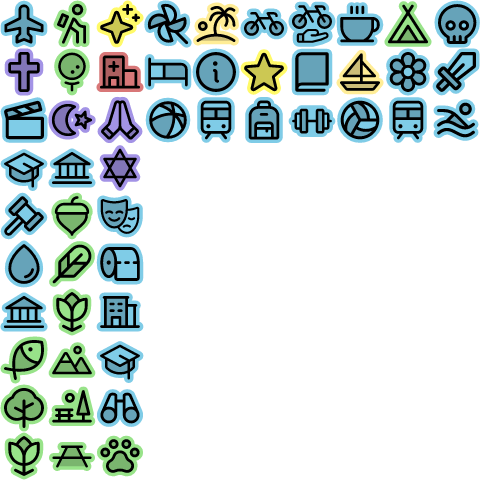

## Phosphor icons as Maplibre GL sprite
[Phosphor icons](https://phosphoricons.com/) are great! This project uses a small selection of them with a background color to show on a map as 24x24px icons.

- **Square shaped:**

  

- **die cut:**

  

## Generate
The icons in the `models` folders were made with [Affinity Designer 2](https://affinity.serif.com/en-us/designer/). 
To generate the sprite, I use [spreet](https://github.com/flother/spreet). Once installed, just do:

```bash
./generate.sh
```